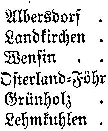

# ocropus-models
Here are some of my models I created for text recognition with OCRopus https://github.com/tmbdev/ocropy

## sh1890.pyrnn.gz
German book from the end of 19th century ("Ortschafts-Verzeichnis für die Provinz Schleswig-Holstein"). The complete book can be found here: http://dibiki.ub.uni-kiel.de/viewer/resolver?urn=urn:nbn:de:gbv:8:2-2750405 With the model you can achieve an error rate somewhere between 1.5% and 0.7%. 

## verlustliste_österreich-ungarn
This model can be used to recognize the WW1 casualty lists of Austria-Hungary (Verlustlisten Österreich-Ungarn). 

The model is trained from scratch because of the various diacritical signs. You can find the training data and test data in directory `verlustliste_österreich-ungarn`. Images from the directories ending with `9`have been used for training. Here the development of the error rate is shown:

The model here is iteration 18,000. The data for the plot as well as a Gnuplot script is also contained in the directory `verlustliste_österreich-ungarn`.

I have used the scans from the Landesbibliothek Oberösterreich
http://digi.landesbibliothek.at

